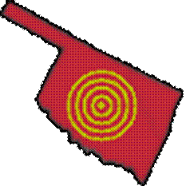

  <main>
    <header>
      <nav class="navbar navbar-inverse navbar-static-top">
        <ul>
          <li>Brett A. Jones</li>
          <li><a href="about.html">about</a></li>
          <li><a href="https://github.com/EvilGreven">github</a></li>
          <li><a class="current">OKQuakes</a></li>
          <li><a href="privacy.html">Privacy Policy</a></li>
        </ul>
      </nav>
    </header>
    <section>
      <article>
        <h1>Getting Started with OKQuakes</h1>
        <ol>
          <li>Launch OKQuakes</li>
            <ul>
              <li>If your device is not able to connect to the internet, a popup will display and ask if you wish to continue.</li>
              <li>If your device is connected to the internet and you can visit other sites, the earthquake list site may be unavailable.</li>
            </ul>
          <li>Earthquakes over the last week may be listed with a nearby city, from newest to oldest, color-coded by magnitude.</li>
            <ul>
              <li class="mag7">Magnitude 7 or greater.</li>
              <li class="mag6">Magnitude 6 to 6.9.</li>
              <li class="mag5">Magnitude 5 to 5.9.</li>
              <li class="mag4">Magnitude 4 to 4.9.</li>
              <li class="mag3">Magnitude 3 to 3.9.</li>
              <li class="mag2">Magnitude 2 to 2.9.</li>
              <li class="mag1">Magnitude 1 to 1.9.</li>
             <li class="mag0">Magnitude 0.9 or lower.</li>
            </ul>
          <li>To scroll up or down on the list, <em>press and drag</em> your finger up or down.</li>
          <li>To select an earthquake in the list to view, <em>press</em> on the earthquake.</li>
            <ul>
              <li>This will bring up a Google Map showing where the epicenter of the earthquake is located.</li>
              <li>To view more details, <em>press</em> the pin marking the epicenter.</li>
              <li>To return to the earthquake list, press the device's <em><a href="http://www.androidcentral.com/know-your-buttons">back button</a></em>.</li>
              <li>Alternatively, you may press the device's <em><a href="http://www.androidcentral.com/know-your-buttons">menu button</a></em> and select "Back" from the menu.</li>
              <li>A "Magnitude Key" may also be viewed from the menu.</li>
            </ul>
          <li>To refresh the earthquake list, press the device's <em>menu button</em> and select "Refresh" from the menu.</li>
          <li>To view a map of multiple earthquakes, press the device's <em>menu button</em> and select "View Map" from the menu.</li>
            <ul>
              <li>To view all earthquakes this week, select "View All" from the submenu.</li>
              <li>To view all earthquakes today, select "View Today" from the submenu.</li>
              <li>To close this dialog and return to the earthquake list, select "Back" from the submenu or press the device's <em>back button</em>.</li>
            </ul>
          <li>To view various external resources, press the device's <em>menu button</em> and select "Links" from the menu.</li>
            <ul>
              <li>To view the source for the earthquake list, select "Datasource" from the submenu.</li>
              <li>To visit the Oklahoma Geological Survey (OGS), select "OK Geo Survey" from the submenu.</li>
              <li>To report an earthquake to the OGS, select "Report Earthquake" from the submenu.</li>
              <li>To visit this website, select "Author" from the submenu.</li>
              <li>To close this dialog and return to the earthquake list, select "Back" from the submenu or press the device's <em>back button</em>.</li>
            </ul>
        </ol>
      </article>
        <h1>About OKQuakes</h1>
        
OKQuakes is a free and ad-free Android app.  I created it as a public service, as the data source is not my own, but pulls data from the United States Geological Service

        
The earthquake list does not necessarily show every earthquake, nor is it updated all of the time.  Automated earthquake logging is limited, and many smaller earthquakes must be manually added.

        
Consequently, only bigger quakes will show up outside office hours.  Smaller quakes may be manually added later.

        
<a href="privacy.html">Privacy Policy</a>

      </article>
    </section>
        <aside>
        <figure>
          
          <figcaption>
            <a href="https://play.google.com/store/apps/details?id=com.evilgreven.okquakes">OKQuakes</a>, my first Google Play app.
          </figcaption>
        </figure>
    </aside>
    <footer>
      <table>
        <tr>
          <td>Phone:</td>
          <td>405-657-4753</td>
          <td>E-mail:</td>
          <td>evil_greven@yahoo.com</td>
        </tr>
      </table>
    </footer>
  </main>
